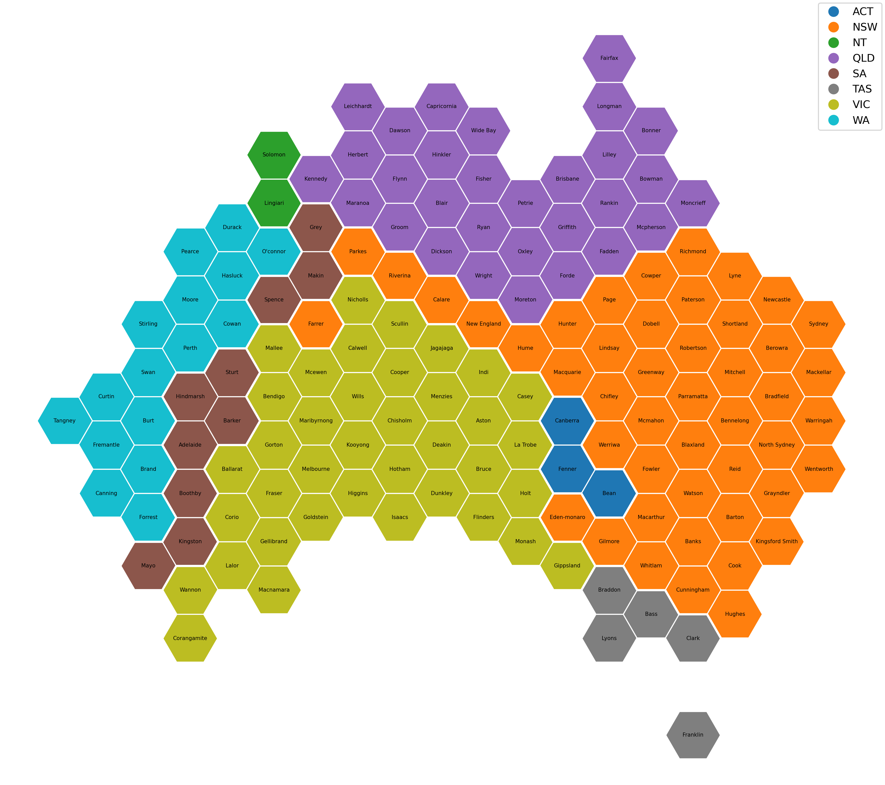

So I got all inspired by some of the US election data viz, in particular some of the mapping of states as abstract shapes with areas proportional to the number fo college votes they have. The issue is that without doing this, you see a lot less blue (Democrat) on a regular map than there really is (in terms of number of votes). This is due to many of the densely populated states tending to be blue-leaning (think north-east).

Well in Victoria, we have a similar issue, we have 88 districts (i.e. lower-house electorates), but 6 or 7 of them (by eyeball) cover more than half the state. So when you show a map of the electorates, these electorates swamp the viz, and the smaller (but just as populated) electorates shrink to invisibility. The map below shows the 88 districts (bounded by the white lines) and their regions (coloured; each of the 88 districts roll-up to one of 8 upper-house regions).

I had a bit of a hunt for a library that dies what I want, but I couldn't see quite what I was after. So I wote some [Python code](https://gist.github.com/smcateer/d810f397f39b4153f0a555d0363b488c) to generate the hex tiles and them associate them with the original geometries. The approach is pretty rough, the code rougher ... but it is *basically* doing what I want.

There's a bit to unpack here:

* Why is Melbourne so far west? Well, if you think about how much population is east versus west of the CBD, and the wedge-shape of Victoria (with more area to the west), it makes sense that Melbourne is pushed west.
* The regions (coloured areas) mostly remain contiguous ... apart from two of the rural ones that get spread around the edge of the state - smashed against the border by a ravenously expanding Melbourne! But then when you think about it, where *should* they be? They each cover wide stretches of the border of Victoria and touch many other regions.
* Eyeballing the districts I know, it looks like the neighbouring ones have remained roughly neighbouring.
* Overall, I think this is not a terrible representation, but I do think the algorithm for allocating the geometry (districts here) to hex tiles could use some tweaking.
* I have only tested this on a couple of Victorian regions ... it would be interesting to see what it looks like on other geometries.

I am 100% happy for anyone who finds the code useful to use it ... it would be great to hear from you if you do. I would like to work it into a proper library. Some day.

(The bits that this code does, that I couldn't see in other libraries, it the bit in which the grid is automatically constructed to match the geometry of the original map, and the automatic allocation of geometries to tiles .. I get the feeling this tends to be done manually, but I am happy to be shown otherwise).

Bonus: Here are the federal electorates coloured by state (poor old SA got squished!):

